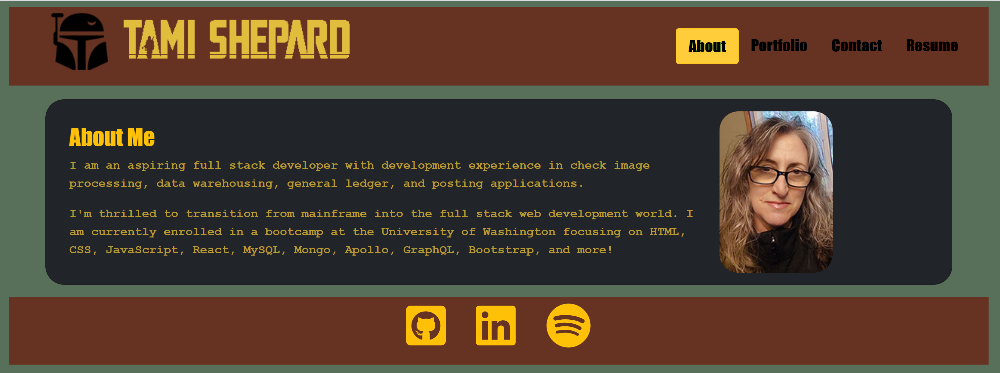
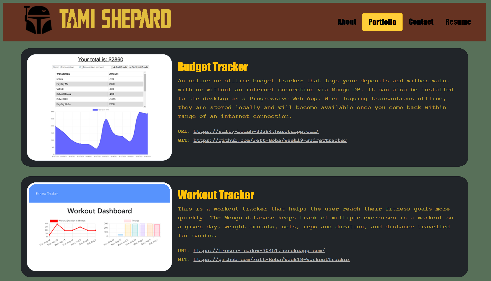
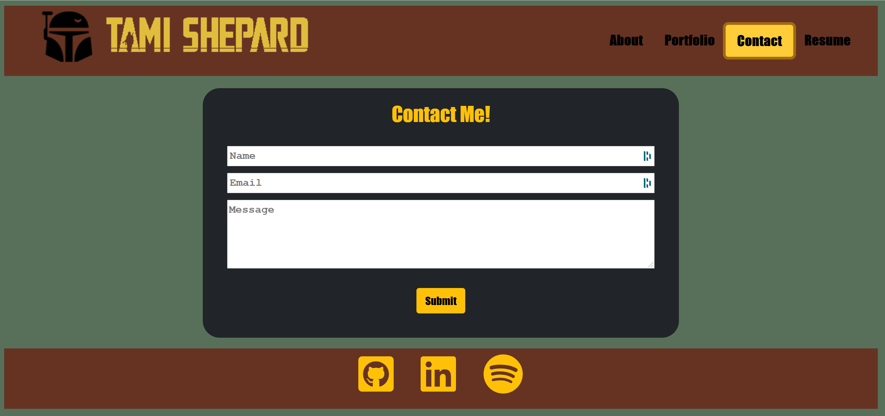
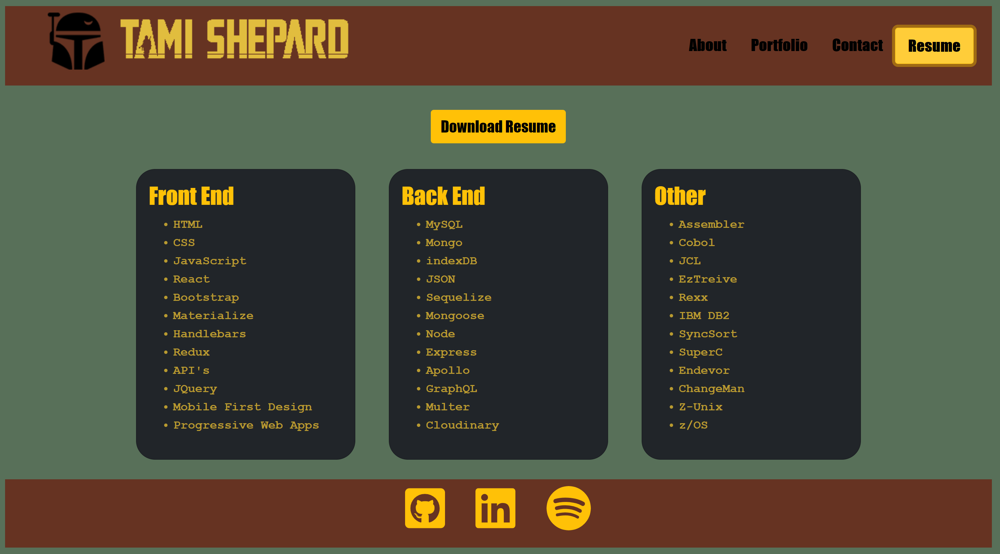

# Week20 React Portfolio

## Link to Portfolio

https://fett-boba.github.io/week20-portfolio/

## Description

The final portfolio update showcases several more projects, and is deployed to GitHub pages to make it more widely available. 

- The portfolio is a single page application.
- The portfolio is implemented with React.
- The portfolio is deployed to GitHub Pages.

## Requirements

- Page will have a header, content, and footer section
- Header will contain a navbar with About, Portfolio, Contact, and Resume options
- Title in the navbar corresponding to the current section will be highlighted.
- About page will be displayed on initial page load, and will contain a photo, and bio.
- Portfolio page will display six projects with links to the deployed app as well as the GitHub Repository.
- Contact page will contain a form with name, email, and message. If form field is not filled out, a message will display indicating the field is reqired.  The email address will also be validated.
- Resume page will display my proficiencies along with an option to download my resume.
- Footer will provide icons to my GitHub, LinkedIn, and a third platform.

---